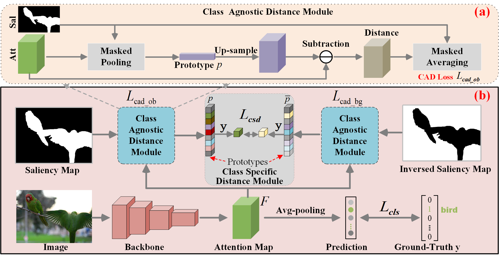

# Saliency Guided Inter and Intra-Class Relation Constraints for Weakly Supervised Semantic Segmentation


Introduction
------------
This is the source code for our paper **Saliency Guided Inter and Intra-Class Relation Constraints for Weakly Supervised Semantic Segmentation**


Network Architecture
--------------------
The architecture of our proposed approach is as follows



## Installation

* Install PyTorch 1.7.0 with Python 3 and CUDA 11.0

* Clone this repo
```
git clone https://github.com/NUST-Machine-Intelligence-Laboratory/I2CRC
```

### Download PASCAL VOC 2012 

* Download [PASCAL VOC 2012](http://host.robots.ox.ac.uk/pascal/VOC/voc2012/#devkit)

## Testing
* Download our trained model [checkpoint_69.3.pth](https://icrc.oss-cn-shanghai.aliyuncs.com/checkpoint_69.3.pth) and put it in the `segmentation/data/models` folder

```
cd segmentation

python main.py test --config-path configs/voc12.yaml --model-path data/models/checkpoint_69.3.pth

python main.py crf --config-path configs/voc12.yaml
```

## Training

```
cd classification
```
* Download the pre-computed [saliency map](https://icrc.oss-cn-shanghai.aliyuncs.com/saliency_aug.tar.gz). (You need to go to utils/LoadData.py and set the path Line 100.) Then train the classification model and obtain CAM. 
```
./train.sh 
./test.sh 
```


* Generate the pseudo labels 
```
python gen_gt.py
```

* Then train the segmentation model with pseudo labels . (You need to set the path for pseudo labels.)
```
cd segmentation
python main.py train --config-path configs/voc12.yaml
```
* Get the initial prediction for trainaug images. (You need to go to configs/voc12.yaml and set DATASET.SPLIT.VAL = train_aug. Set it back to val when testing)
```
python trainaug_pred.py test --config-path configs/voc12.yaml \
    --model-path data/models/voc12/deeplabv2_resnet101_msc/train_aug/checkpoint_final.pth

python trainaug_pred.py crf --config-path configs/voc12.yaml -j 10
```
* Generate the refined pseudo labels 
```
cd classification
python label_refinement.py
```
* Train the segmentation model with the refined pseudo labels. (You need to set the path for refined pseudo labels.)
```
cd segmentation
python main.py train --config-path configs/voc12.yaml
```


